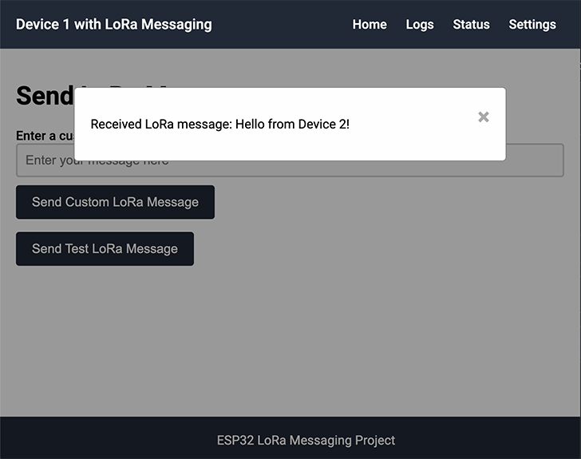
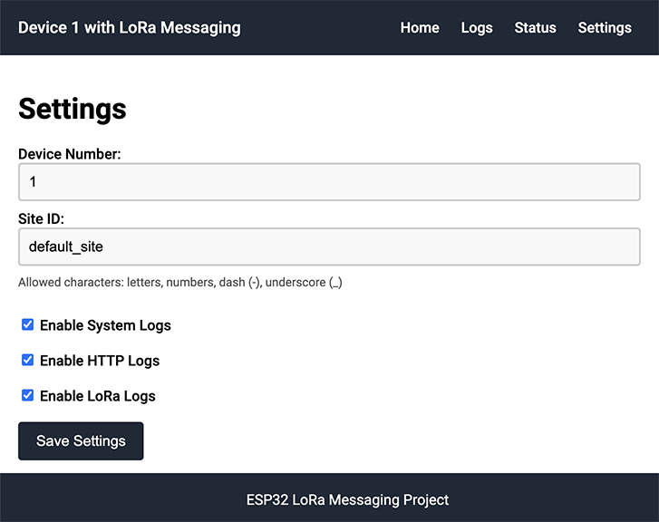

# ESP32 Web + LoRa Demo with OTA & Multi-Device Support
ESP32 Web + LoRa Demo with OTA &amp; Multi-Device Support. This project demonstrates a web interface for ESP32 devices with LoRa communication, Over-the-Air (OTA) updates, and multi-device messaging capabilities. It supports both WiFi and Ethernet for flexible connectivity.

## Table of Contents

- [Features](#features)
- [Hardware Requirements](#hardware-requirements)
- [Software Requirements](#software-requirements)
- [Installation](#installation)
- [Configuration](#configuration)
- [Usage](#usage)
- [Web Interface](#web-interface)
- [OTA Updates](#ota-updates)
- [Troubleshooting](#troubleshooting)
- [Contributing](#contributing)
- [License](#license)

## Features

- **Web Interface**: User-friendly interface to send messages, view logs, and configure settings.
  
    
- **LoRa Communication**: Send and receive messages between two devices using LoRa technology.  
  
    
- **OTA Updates**: Over-the-air firmware updates using ArduinoOTA.
- **Logging**: System, HTTP, and LoRa logs stored with timestamps.
- **Persistent Settings**: Device settings stored using Preferences library. 
  
    
- **Ethernet and Wi-Fi Support**: Connect via Ethernet (PoE) or Wi-Fi.

## Hardware Requirements

- **2 x Olimex ESP32-POE-ISO** boards
- **2 x Olimex LoRa915 modules**
- **Jumper wires or UEXT connectors** to connect the LoRa modules to the ESP32 boards
- **Power** (PoE or USB)

    

## Software Requirements

- **Arduino IDE** or **PlatformIO**
- **ESP32 Board Support Package**
- **Dependencies**:
    - `WiFi.h`
    - `ETH.h`
    - `AsyncTCP.h`
    - `ESPAsyncWebServer.h`
    - `WiFiUdp.h`
    - `ArduinoOTA.h`
    - `NTPClient.h`
    - `SPI.h`
    - `LoRa.h`
    - `deque`
    - `time.h`
    - `LittleFS.h`
    - `Preferences.h`
    - `ArduinoJson.h`

## Installation

### 1. Clone the Repository

`git clone https://github.com/marksowell/esp32-web-lora-demo-ota-multi-device.git`

### 2. Install Dependencies

#### PlatformIO

Dependencies are specified in the `platformio.ini` file.

#### Arduino IDE

Use the Library Manager to install the required libraries.

### 3. Hardware Setup

#### Connections

- Connect the LoRa915 module to the ESP32-POE-ISO via UEXT connector or jumper wires.
    
- Pin connections:
    
    |LoRa915 Module|ESP32-POE-ISO|
    |---|---|
    |MISO|GPIO 19|
    |MOSI|GPIO 23|
    |SCK|GPIO 18|
    |SS|GPIO 5|
    |RST|GPIO 14|
    |DIO0|GPIO 26|
    |3.3V|3.3V|
    |GND|GND|
    

#### Antenna

- Ensure that an appropriate antenna is connected to the LoRa915 module.

### 4. Flash the Firmware

- Open the project in your development environment.
    
- Update Wi-Fi credentials in `main.cpp`:
  
  ```
  const char* ssid = "Your_SSID";
  const char* password = "Your_Password";
  ```
  
- Compile and upload the firmware to both ESP32 devices.

## Configuration

### Device Settings

- **Device Number**: Unique identifier for the device.
- **Site ID**: Identifier to match messages between devices (default is `default_site`).
- **Logging Settings**: Enable or disable system, HTTP, and LoRa logs.

### Accessing the Web Interface

- Connect to the ESP32 device via its IP address (displayed in Serial Monitor).
- The web interface allows you to:
    - Send LoRa messages.
    - View connection and system logs.
    - Check system status.
    - Update device settings.
    - Reboot the device.

## Usage

### Sending a LoRa Message

1. Access the web interface of **Device A**.
2. Navigate to the **Home** page.
3. Enter a custom message or use the test message.
4. Click **Send**.

### Receiving a LoRa Message

- **Device B** will automatically receive messages sent from **Device A** if the `siteID` matches.
- Received messages are displayed via a pop-up on the web interface and logged in the system logs.

## Web Interface

The web interface is designed for ease of use:

- **Home**: Send LoRa messages.
- **Logs**: View system, HTTP, and LoRa logs.
- **Status**: Check device uptime, free memory, signal strength, and other system information.
- **Settings**: Update device number, site ID, and logging preferences.
- **Reboot**: Soft-reboot the device.

## OTA Updates

- OTA updates are enabled via `ArduinoOTA`.
- To upload a new firmware:
    - Use the Arduino IDE or PlatformIO's OTA upload feature.
    - The device will log OTA progress and reboot upon completion.

## Troubleshooting

### LoRa Initialization Failed

- Check hardware connections.
- Ensure the correct frequency (`915E6`) is set for the LoRa module.
- Verify that the LoRa module is receiving sufficient power.

### Messages Not Being Received

- Confirm both devices have the same `siteID`.
- Ensure devices are within range and antennas are connected.
- Adjust LoRa parameters (spreading factor, bandwidth) if necessary.

### Web Interface Not Accessible

- Verify the device's IP address via the Serial Monitor.
- Ensure the device is connected to the network.
- Check firewall settings that may block access.

## Contributing

Contributions are welcome! Please open an issue or submit a pull request for any improvements or bug fixes.

### Guidelines

- Follow the existing code style.
- Include comments and documentation where appropriate.
- Test changes thoroughly on actual hardware.

## License

This project is licensed under the MIT License. See the [LICENSE](./LICENSE) file for details.
